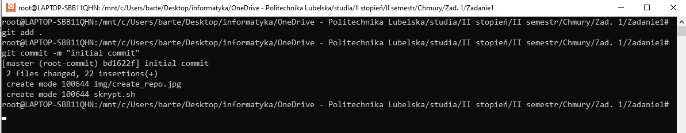
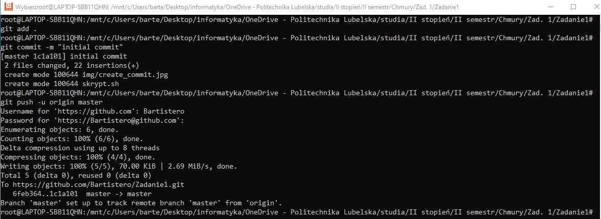
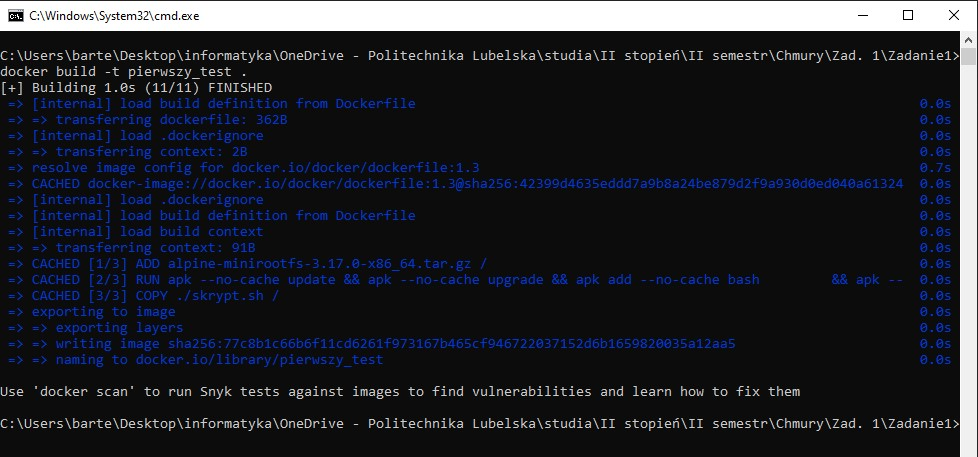
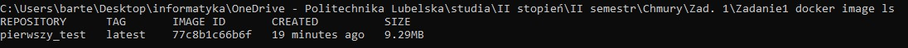
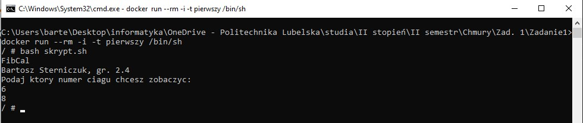

# FibCalc 
>link Github: https://github.com/Bartistero/Zadanie1
>link dockerHub: https://hub.docker.com/repository/docker/bartister99/zadanie1

## Tabela zawartości
* [Zadanie 1 ](#Zadanie-1)
* [Zadanie 2](#Zadanie-2)
* [Zadanie 4.1](#zadanie-4.1)
* [Zadanie 4.2](#zadanie-4.2)
* [Status](#status)
* [Kontakt](#contact)

## Zadanie 1
W zadaniu pierwszym, użytko pliki skryptu `skrypt.sh`
W celu utworzenia repozytorium zdalnego użyto następujących poleceń (gh): 

Następnie wykonano commit i wypchnięto go do zdalnego repozytorium: 

## Zadanie 2
W celu zbudowania obrazu należy wydać polecenie: 
> `docker build -t pierwszy .`

Obraz wyjściowy ma rozmiar `9.29MB`

W celu uruchomienia kontenera należy wydać następujące polecenie: 
> `docker run --rm -i -t pierwszy /bin/sh`

a następnie wykonać skrypt: 
> `bash skrypt.sh`

## Status
Project is: finished

## Kontakt
Created by [@Bartistero](https://github.com/Bartistero/) - feel free to contact me!
