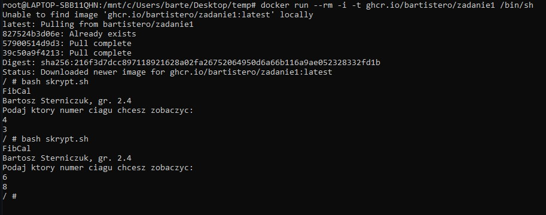

# FibCalc
>link Github: https://github.com/Bartistero/Zadanie1
>link dockerHub: https://hub.docker.com/repository/docker/bartister99/zadanie1

## Tabela zawartości
* [Zadanie 1 ](#Zadanie-1)
* [Zadanie 2](#Zadanie-2)
* [Zadanie 3](#Zadanie-3)
* [Zadanie 4](#zadanie-4)
* [Zadanie 5](#zadanie-5)
* [Status](#status)
* [Kontakt](#contact)

## Zadanie 1
W zadaniu pierwszym, użytko pliki skryptu `skrypt.sh`. Algorytm został napisany przy użyciu języka skryptu powłoki bash, przy wykorzystaniu rekurencyjnej funkcji `fib()`. Przedstawione rozwiązanie zostało wybrane ze względu na potrzebe osiągnięcia jak najmniejszego rozmiaru obrazu. Większość języków wymaga kompilacji przez co rozmiar obrazu znacznie się powiększa. Założono, że dla wartości 0, otrzymujemy wynik 0, zaś dla 1 numeru wartość 1.

W celu utworzenia repozytorium zdalnego użyto następujących poleceń (gh):

Następnie wykonano commit i wypchnięto go do zdalnego repozytorium (użyłem loginu i wygenerowanego tokenu):

## Zadanie 2
W związku z wykorzystaniem języka skryptowego, nie następuje kompilacja i nie ma dostępu do programu z zewnątrz. Zatem w trakcie uruchamiania konternera należy się do niego "podczepić", aby móc wykonywać instrukcyjne. Potrzebne polecenia zostały przedstawione poniżej.

W celu zbudowania obrazu należy wydać polecenie:
> `docker build -t pierwszy .`

Obraz wyjściowy ma rozmiar `9.29MB`

W celu uruchomienia kontenera należy wydać następujące polecenie:
> `docker run --rm -i -t pierwszy /bin/sh`

a następnie wykonać skrypt:
> `bash skrypt.sh`

## Zadanie 3
W zadaniu trzecim opracowany przepływ CI, w którym budowane obrazy są przesyłane do Gh repo, zaś cache do repozytorium na dockerHubie.
Po zapoznaniu się z przedstawioną metodą wersjonowania "semver" i FAQ, przyjąłem następujący sposów wersjonowania.

Zatem w dalszej części sprawozdania wydam pierwszą wersję "0.1.0", następnie zwiększając wersję minor. 

W celu wydania wersji należy utworzyć tag w systemie kontroli wersji, a nastepnie wypchnąć go na zdalne repozyotrium
(Komenda git tag --push nie zalecana według dokumentacji GITa) 

Po wykonaniu komendy push cashe został wysłany do dockerhuba 

Zaś w repozyotium github została utworzony obraz z tagiem wersji 

Następnie podbijemy wersję do 0.1.1, ostatnia cyfra (PATCH), ponieważ następują nieduże zmiany (generalnie zmiana readme). 

Oraz wykonanie się CI: 

Oraz jeszcze jedno podbicie wersji do 0.1.2

## Zadanie 4

W celu sprawdzenia pliku "fib.yml" należy wykonać następujące komendy: 

> `gh workflow view`

Ręczne uruchomienie workflow'a 

> `gh workflow run CI`

Pobranie obrazu z gh repo: 

## Zadanie 5
W celu wykonania zadania dodatkowego wykonałem kolejny skrypt tym razem wymagający kompliacji skrypt.py (w języku python).  

## Status
Project is: finished

## Kontakt
Created by [@Bartistero](https://github.com/Bartistero/) - feel free to contact me!
